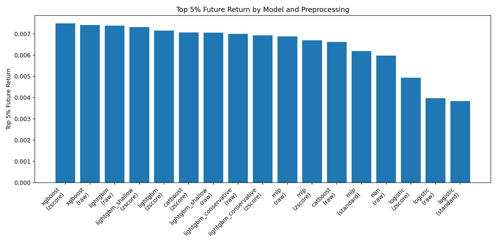
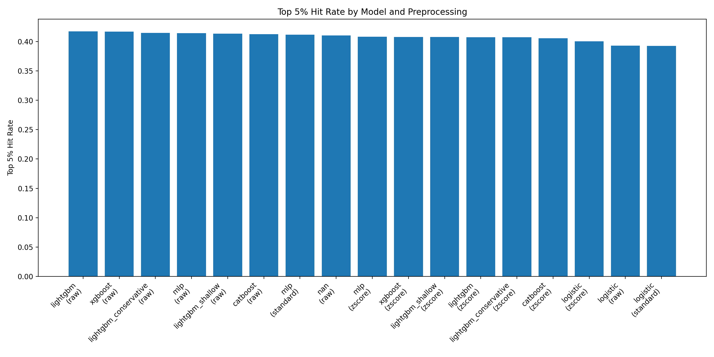
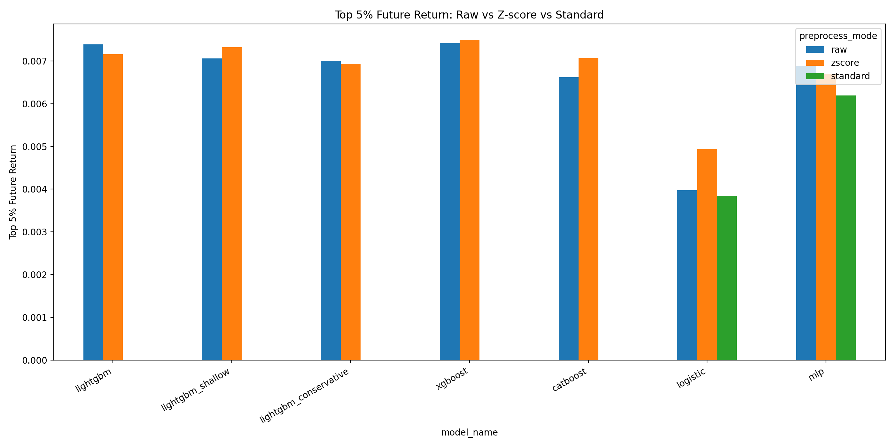
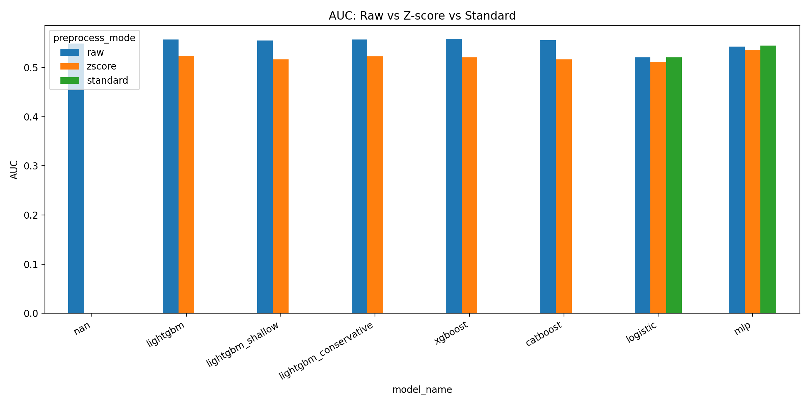
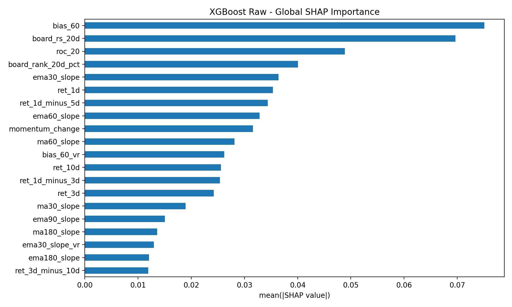
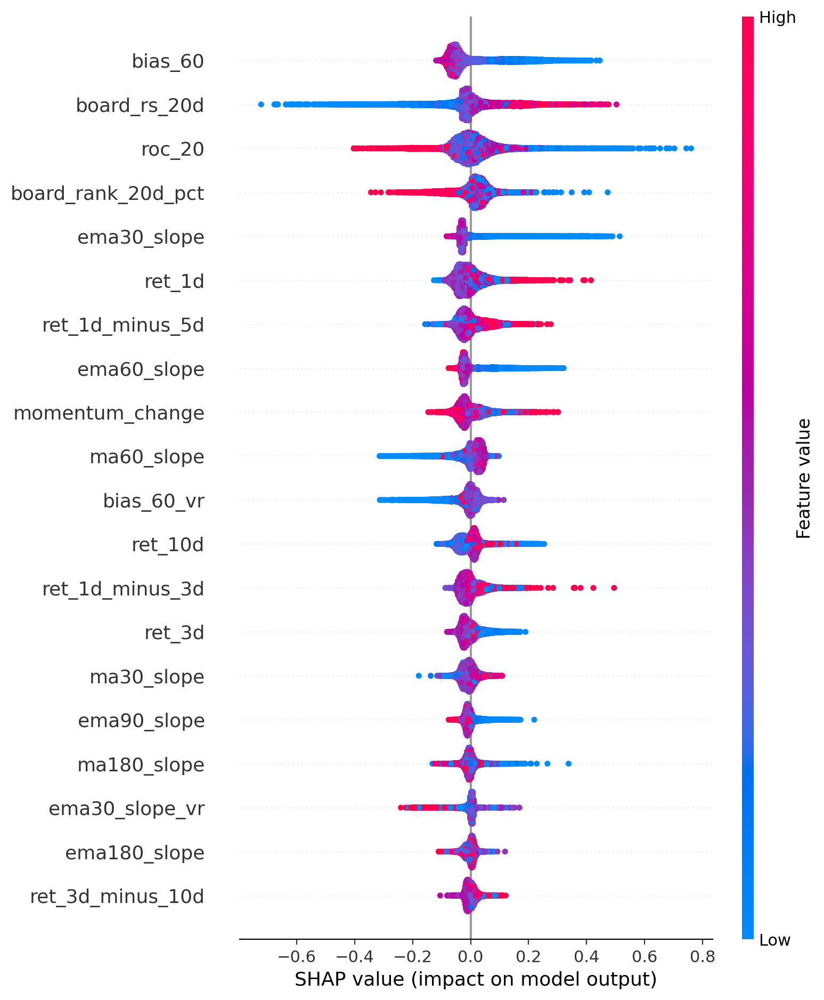
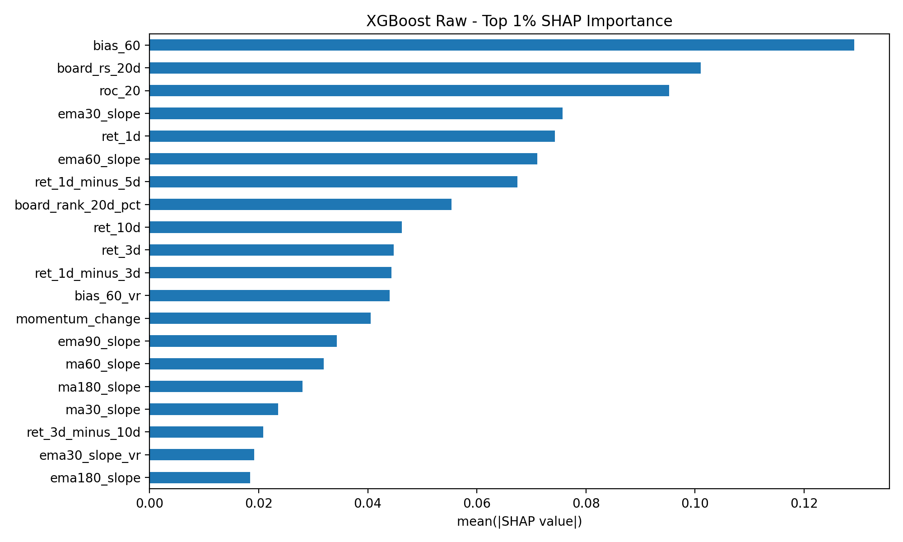
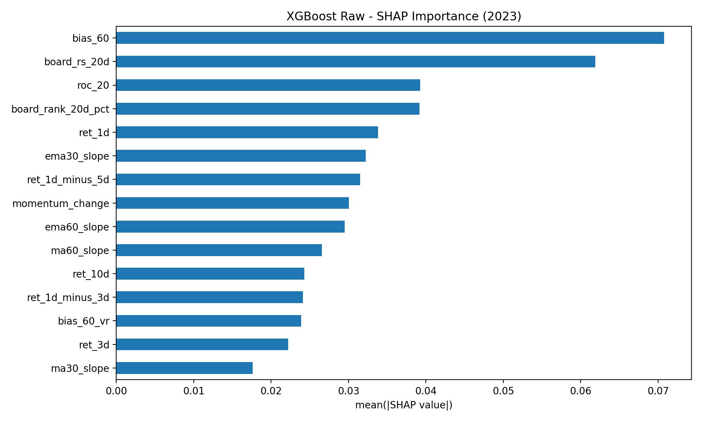
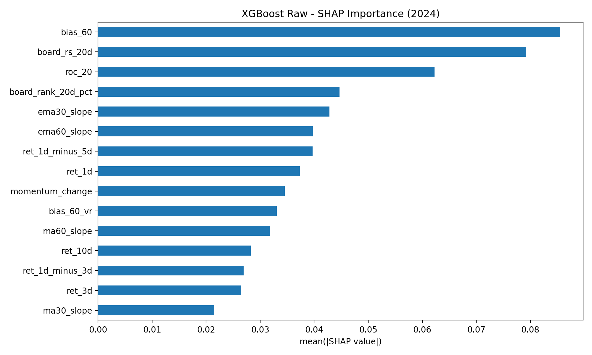
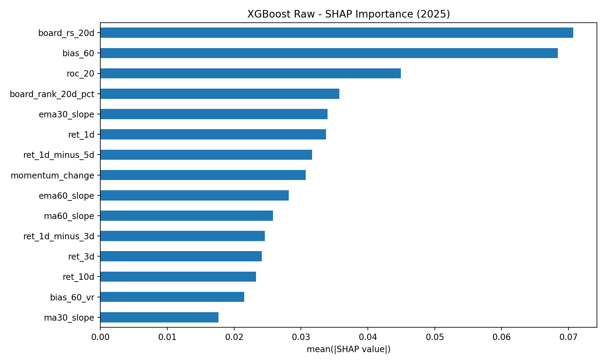

# Explainable Short-Horizon Stock Selection

A machine learning framework for short-horizon stock selection, optimized for **Top-K return performance** and enhanced with **SHAP-based interpretability**.

---

## 📌 Project Overview

This project builds a machine learning pipeline to identify stocks with strong return potential over the next 5 trading days.

Instead of focusing on classification accuracy alone, this project emphasizes:

* Cross-sectional ranking
* Top-K return performance
* Model interpretability (SHAP)

---

## 🎯 Objective

Given a set of features for each stock on each trading day, predict whether the stock will achieve positive returns over the next 5 days.

**Target definition:**

```text
regime_binary = 1 if r_future_5 > 0.01 else 0
```

**Data split:**

* Train: before 2023
* Test: after 2023

---

## 🧠 Key Ideas

* Treat stock prediction as a **ranking problem**
* Focus on **Top-K return instead of accuracy**
* Compare multiple models and preprocessing methods
* Use SHAP to understand model behavior

---

## 📊 Dataset

The dataset is not included in this repository.

Download from:

👉 [Releases → stock_shap dataset]

**Features include:**

* Multi-horizon returns (`ret_1d`, `ret_3d`, `ret_10d`)
* Momentum (`roc_20`)
* Trend (`ema_slope`, `ma_slope`)
* Relative strength (`board_rs_20d`)
* Mean-reversion (`bias_60`)
* Cross-sectional ranking features

---

## ⚙️ Pipeline

1. Data loading
2. Feature engineering
3. Label construction
4. Outlier clipping
5. Train-test split (time-based)
6. Preprocessing:

   * raw
   * z-score (cross-sectional)
   * standard scaling
7. Model training
8. Evaluation
9. SHAP analysis

---

## 🤖 Models

* Logistic Regression
* Random Forest
* LightGBM
* XGBoost
* CatBoost
* MLP

---

## 📈 Evaluation Metrics

* AUC
* Top 1% / 3% / 5% hit rate
* Top 1% / 3% / 5% future return ⭐
* Probability bucket performance

---

## 🏆 Key Results

* XGBoost achieves the best **Top 1% return performance**
* LightGBM shows stable performance across metrics
* MLP achieves highest AUC but weaker trading performance

> **Key insight:**
> Classification accuracy does not directly translate to investment performance.

---
## 📊 Model Performance

### Overall Comparison





---

### Grouped Comparison




## 🔍 SHAP Analysis

We select **XGBoost (raw features)** as the final model based on Top 1% return.

### Global Feature Importance



---

### SHAP Summary Plot



---
### Top 1% Feature Importance



---

### Stability Across Years





---

### Key Insights

* **Momentum effect**

  * High `board_rs_20d`, `roc_20` → higher probability of future gains

* **Trend effect**

  * Positive slope features → bullish signal

* **Mean reversion**

  * High `bias_60` → negative contribution

> The model captures a combination of:
> **Momentum + Trend + Mean Reversion**

---

### Stability Across Years


Feature importance remains consistent across years, indicating stable patterns rather than overfitting.

---

## 📂 Project Structure

```text
.
├── figures/                         # Model performance plots
│   ├── bar_top5_future_return_all.png
│   ├── bar_top5_hit_rate_all.png
│   ├── grouped_auc.png
│   └── grouped_top5_future_return.png
│
├── shap_outputs_xgboost_raw/        # SHAP results (final XGBoost model)
│   ├── global_shap_bar.png
│   ├── global_shap_summary.png
│   ├── top1_shap_bar.png
│   ├── year_2023_shap_bar.png
│   ├── year_2024_shap_bar.png
│   └── yearly_shap_importance.csv
│
├── model_compare_summary*.csv       # Model comparison results
│
├── config.py                        # Config & paths
├── data_pipeline.py                 # Raw feature pipeline
├── data_pipeline_standard.py        # Standardized / z-score pipeline
├── evaluate.py                      # Evaluation metrics
├── models.py                        # Model definitions
├── plot_figure.py                   # Visualization scripts
├── shap_analysis.py                 # SHAP analysis
├── train_model_compare.py           # Model comparison (raw)
├── train_model_compare_standard.py  # Model comparison (preprocessed)
├── requirements.txt
└── README.md

---

## 🚀 How to Run

Install dependencies:

```bash
pip install -r requirements.txt
```

Train models:

```bash
python train_model_compare.py
```
```bash
python train_model_compare_standard.py
```

Compare preprocessing:

```bash
python train_model_compare.py
```
```bash
python train_model_compare_standard.py
```
Run SHAP analysis:

```bash
python shap_analysis.py
```

---

## ⭐ Highlights

* Time-based split (no data leakage)
* Focus on **Top-K return (practical trading metric)**
* Multi-model comparison
* SHAP interpretability
* Stable feature importance across years

---

## 📌 Future Work

* Rolling window backtesting
* Portfolio construction
* Transaction cost modeling
* Feature expansion (volume, fundamentals)
* Model ensemble
